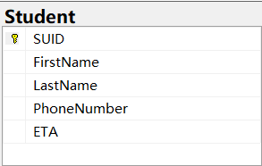

#  EVENING SHUTTLE FROM CAMPUS  
## Motivation: Pilot program. If it goes well, convince SU to fund a larger program.

Students can install an app on their phones which lets them request a ride from campus. The app makes an HTTP request to
your server with the students SUID. Assume that all valid SUIDs are in a db table. Check that the SUID from the req is
in the db, if yes, continue. The student's app expects an ETA as response, which may be 0. In exceptional circumstances,
your server may respond with an error "service unavailable".[http://ip/requestPickup?suid=123456789][example response]
There is one shuttle in the system and one campus stop. If the shuttle has no passengers, it waits at the stop. If the
shuttle has one passenger, it drives to the passenger's home, drops them off, and returns to the stop. If the shuttle
has multiple passengers, it keeps their addresses in an ordered list, and does the drop-offs in that order. When all the
passengers have been dropped off, it returns to the campus stop.
The shuttle makes one HTTP request to your server for every student who gets on the shuttle.
[http://ip/addPassenger?suid=123456789&address="123 elm st, city, ST zip"]
The shuttle makes one HTTP request to your server, every second, with its position (long,lat).
[http://ip/shuttleLocation?longitute=12.3&latitude=34.2]

[Student APP]( http://localhost:5000 ): http://localhost:5000  
[Evening Shuttle Service](http://localhost:8080): http://localhost:8080  
Database: sqlserver://localhost:1433;databaseName=EveningShuttle  

### Author: 
Yuao Ai

### Run
#### Shuttle Service: 
Run EveningShuttle\demo\src\main\java\com\example\demo\DemoApplication
#### Student APP: 
Run SendHttp\app.py

### Table 

### Design Patterns
Service Layer: Strategy, Singleton,Template Method 
Controller Layer: Facade

### The Logic for Picking up a Student:
1) Student APP sends a http request to Shuttle Service
2) In Controller layer: use addRequest(SUID) to process the request
3) addRequest(SUID) can determine whether the student is valid
4) If it is valid, call requestPickup() in Service, otherwise, return error message.

### Directory Structure

| Folder (com/example/) | Contents                          | 
|-----------------------|-----------------------------------|
| controller/           | Controller Layer                  | 
| demo/                 | Important classes and APP's Entry |
| service/              | Service Layer                     |
| utils/                | Some Helper Classes               |

### Front-End Structure
| Folder (resources/) | Contents                          | 
|---------------------|-----------------------------------|
| templates/          | Some HTML template files          | 
| static/             | Static resources: JavaScript file |

